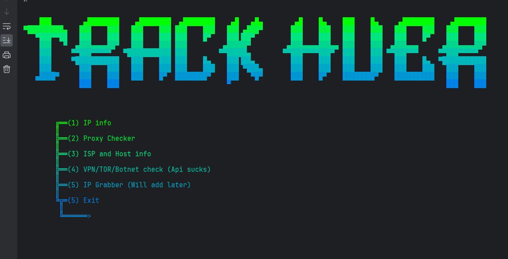
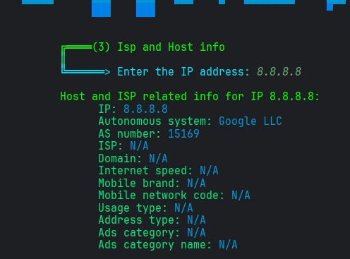
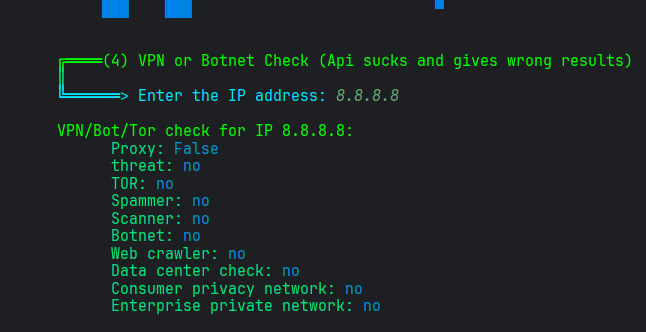
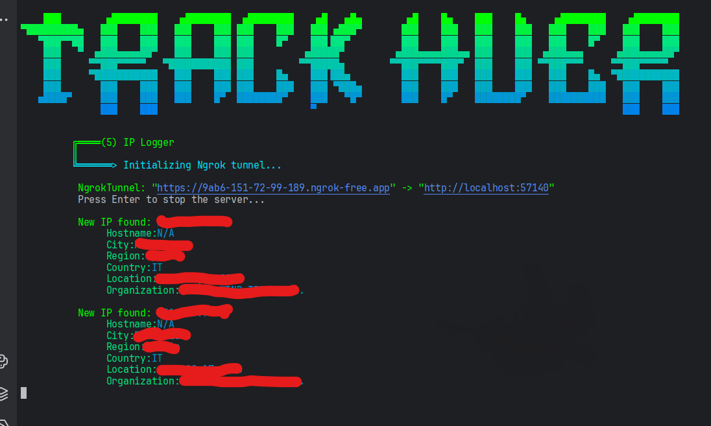

# Track Huer
Multitool that includes info gatherer on a given IP address (Host, ISP), IP Geolocator, proxy checker, threat checker and IP Logger. (The name comes from tracker + hue xdd)

# 💻 Code
The multitool presents a simple ASCII interface, 2 custom banners, and a menu with 5 options:

- IP info: uses ip-location api to scan a given address, giving you informations such as hostname, city, region and country, location (in coordinates) and organisation.
- Proxy checker: uses proxychecker api to analyze an ip address, finds out wether its residential or part of a business, and if its a proxy/vpn.
- Host/ISP info: uses IP2location api to get lots of info related to the isp, host, company, etc.
- VPN/Tor/Botnet check: checks in known databases if the ip is a potential threat. The databases are very old cuz it wont recognize anything at all, dont use this function, use Proxy checker instead. 
- Ip grabber: creates a simple ngrok tunnel, gets the ip of every visitor and uses a simple api to gather information about the victim. You can find more info on my [ip logger page](https://github.com/Hue-Jhan/IP-logger-and-tracker)

Links to API: [ip-location](https://api.iplocation.net/), [proxy checker](https://proxycheck.io/) and [Host/ISP info](https://www.ip2location.io/) + [Vpn/Tor/Botnet checker](https://www.ip2location.io/)

 

---

---

---

---

---

---

---

---

---

---

---

---

---

---

---

---

---

---

---
Here is the ip logger, more info about this on my page here [https://github.com/Hue-Jhan/IP-logger-and-tracker](https://github.com/Hue-Jhan/IP-logger-and-tracker):

