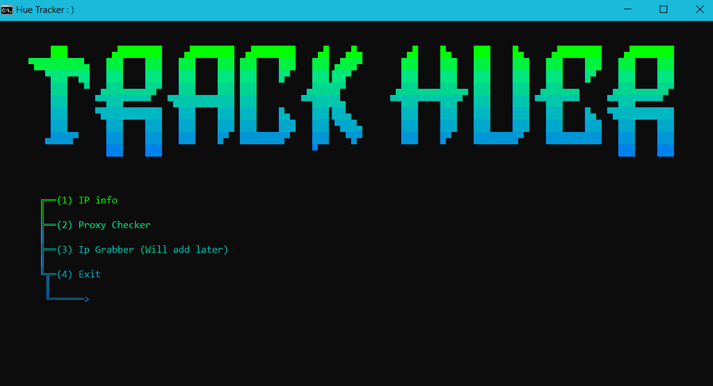

# Track Huer
Multitool that gets info on a given IP address like Host, ISP, location, checks if its a proxy and more. (The name comes from tracker + hue xdd)

# 💻 Code
The multitool presents a simple ASCII interface, and a menu with 3 options:

- IP info: uses ip-location api to scan a given address, giving you informations such as hostname, city, region and country, location (in coordinates) and organisation.
- Proxy checker: uses proxychecker api to analyze an ip address, finds out wether its residential or part of a business, and if its a proxy/vpn.
- Ip grabber: imma add this in the future. 

Links to API: [ip-location](https://api.iplocation.net/) and [proxy checker](https://proxycheck.io/)

